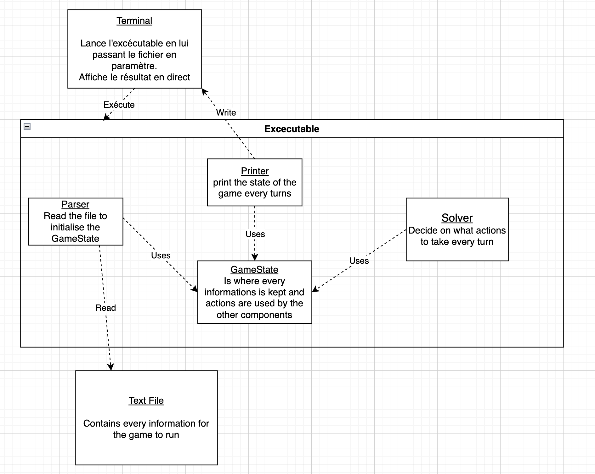

# go-epitech

This project is made in golang and is made in order to simulate a place. The follwing instructions are for linux only users.
You must have golang installed in order to run the project.

## How to Compile
In order to compile this project your need **golang** installed.
```bash
go build -o go-entrepot ./main.go
```

## How to run it
In order to run it you must first compile the program. After compiling you must use or make a file that follows the instruction in the given [PDF](doc/Projet%20de%20gestion%20d'entrepo%CC%82t.pdf). Afterward you must choose a file and put its path in the follwing way :
```bash
./go-entrepot ./my-file.txt
```
There is a few example file present in the example section.

## Organisation and Code

### Package & Sources

Our packages are organize following this way:

- solver: This part is the brains of the code. It contains only code that will be used in order to move pieces and to cohordinate the different objects.
- parser: Will make sure the file is possible to run.
- game: contains every element the game is made of. It also contains functions that will move or place certain pieces.

### Code Strategy

Our algorithm works this way:

*Truck*:
- Check if the *Truck* is full
    - Yes: **GO**
    - No : Check if in a radius of the time it takes to move if there is a Transpalatte with a package light enough to enter
        - Yes: **WAIT**
        - No : **GO**

*Transpalette*:
- Check how many *Packages* are at the closest distance from the *Transpalette*
- **Go** in the direction of the closest *Package* unless it is the only choice of an other *Transpalette*
- **Take** the Package
- **Go** to the designated *Truck*
- **Drop** the Package if possible


## Diagram
This is the level 3 component diagram of our project.


# Made by
BLARD Justin
CARDINEAU Djilani
BARAOU Corentin